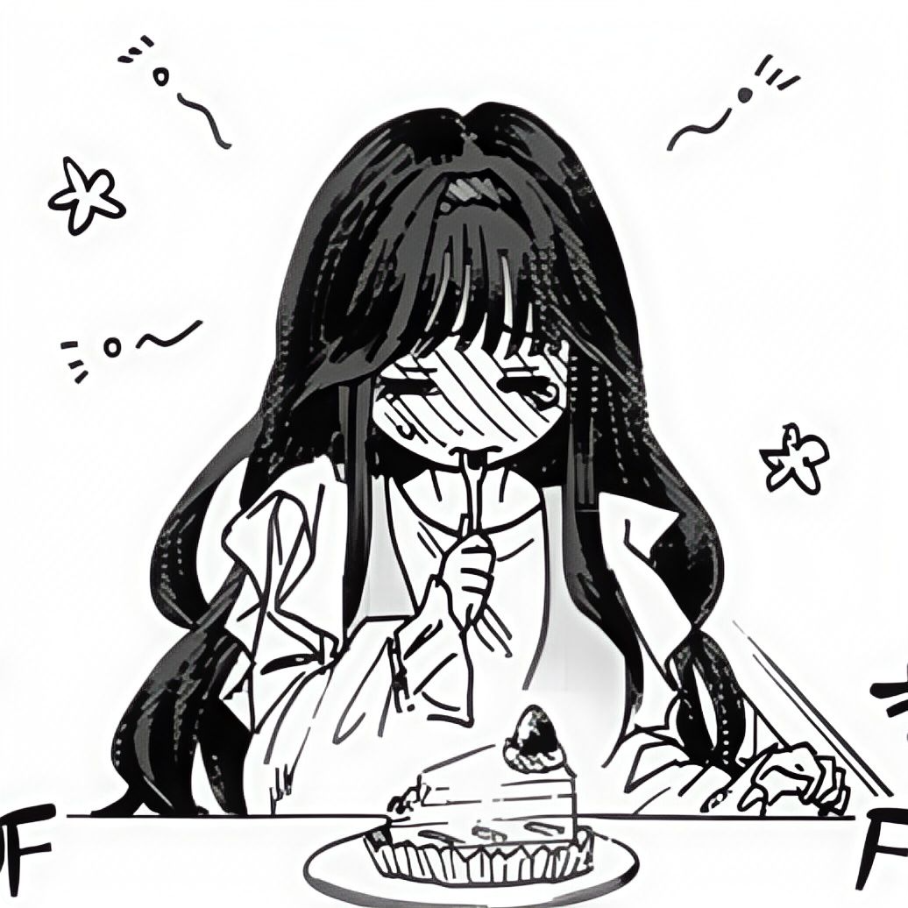

<!-- header -->

<!-- 右圖  -->

 
<!-- 左圖  -->

 
 

- 本名：**和栗 薫子（わぐり かおるこ） / Waguri Kaoruko**

- 年齡：**16 歲**

- 出生：**7 月 22 日｜巨蟹座**

- 血型：**B 型**

- 身高：**148 cm**

- 所屬：**桔梗女校｜高中生**

- 髮色：桔梗紫  

- 瞳色：藍瞳  

- 特色萌點：長捲髮、髮帶、黑色連褲襪、高嶺之花氣質、治癒系、美少女  

- 個性與喜好：溫柔、甜食控、安靜、有氣質的小天使  

- 聲優：**井上穗乃花（TV 動畫）**、**和氣杏未（漫畫宣傳片）**

- 個人狀態：**與凜太郎熱戀中**

 
  

  

  

  

 

<table align="center">
  <tr>
    <td width="500">
      
    </td>
    <td width="270">
      
    </td>
  </tr>
  <tr>
    <td align="center">
      "謝謝你一直鼓勵我，現在的我能打起精神，全靠有你在。" – 和栗薰子
    </td>
    <td align="center">
      "下次一起吃蛋糕吧！" – 和栗薰子
    </td>
  </tr>
</table>

 

<table align="center">
  <tr>
    <td align="center">
      
       
      <b>䌷凛太郎</b>
    </td>
    <td align="center">
      
       
      <b>宇佐美翔平</b>
    </td>
    <td align="center">
      
       
      <b>夏泽朔</b>
    </td>
    <td align="center">
      
       
      <b>依田绚斗</b>
    </td>
    <td align="center">
      
       
      <b>和栗薰子</b>
    </td>
    <td align="center">
      
       
      <b>保科昴</b>
    </td>
  </tr>
</table>

 

  
  
  
  
  

  
  
  
  
  
  

 

<!-- footer -->
