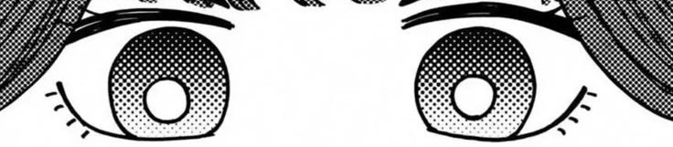

<!-- header -->

<!-- 右圖 -->

 
<!-- 左圖 -->

 
 

- 本名：**和栗 薫子（わぐり かおるこ） / Waguri Kaoruko**

- 年齡：**16 歲**

- 出生：**7 月 22 日｜巨蟹座**

- 血型：**B 型**

- 身高：**148 cm**

- 所屬：**桔梗女校｜高中生**

- 髮色：桔梗紫  

- 瞳色：藍瞳  

- 特色萌點：長捲髮、髮帶、黑色連褲襪、高嶺之花氣質、治癒系、美少女  

- 個性與喜好：溫柔、甜食控、安靜、有氣質的小天使  

- 聲優：**井上穗乃花（TV 動畫）**、**和氣杏未（漫畫宣傳片）**

- 個人狀態：**與凜太郎熱戀中**

 
 

 
 
  

  

  

  

 
 

<table>
  <tr>
    <td width="500">
      
    </td>
    <td width="270">
      
    </td>
  </tr>
</table>

"謝謝你一直鼓勵我，現在的我能打起精神，全靠有你在。" – 和栗薰子&nbsp;&nbsp;&nbsp;&nbsp;&nbsp;&nbsp;&nbsp;&nbsp;&nbsp;&nbsp;&nbsp;&nbsp;&nbsp;&nbsp;&nbsp;&nbsp;&nbsp;&nbsp;&nbsp;&nbsp;&nbsp;&nbsp;&nbsp;&nbsp;&nbsp;&nbsp;&nbsp;&nbsp;&nbsp;&nbsp;&nbsp;&nbsp;&nbsp;&nbsp;&nbsp;&nbsp;&nbsp;&nbsp;&nbsp;&nbsp;&nbsp;&nbsp;&nbsp;&nbsp;&nbsp;&nbsp;&nbsp;&nbsp;&nbsp;&nbsp;&nbsp;&nbsp;&nbsp;&nbsp;&nbsp;"下次一起吃蛋糕吧！" – 和栗薰子

 
 

  
  
  
  
  
  

 

<!-- 

        

 -->
 

<!-- footer -->

